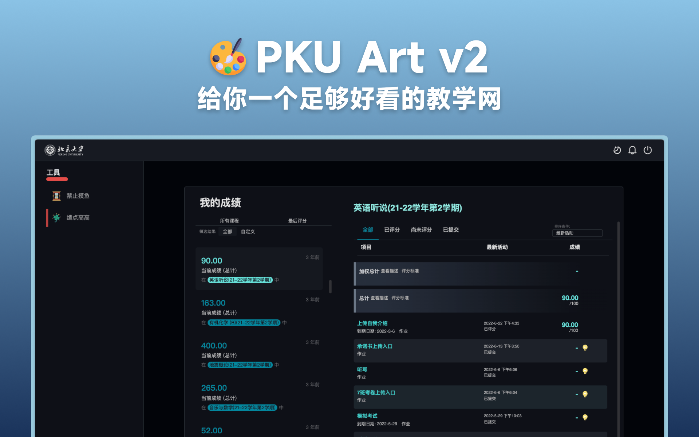
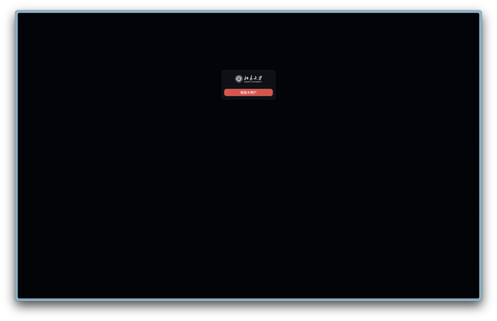
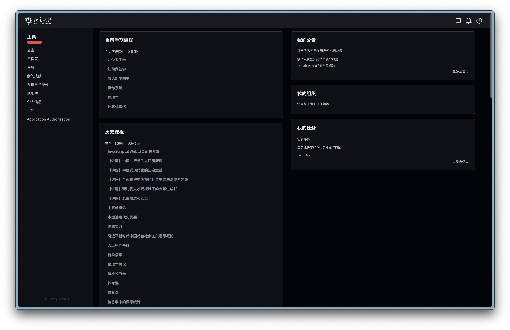
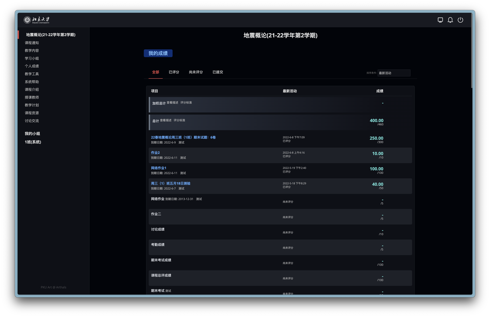
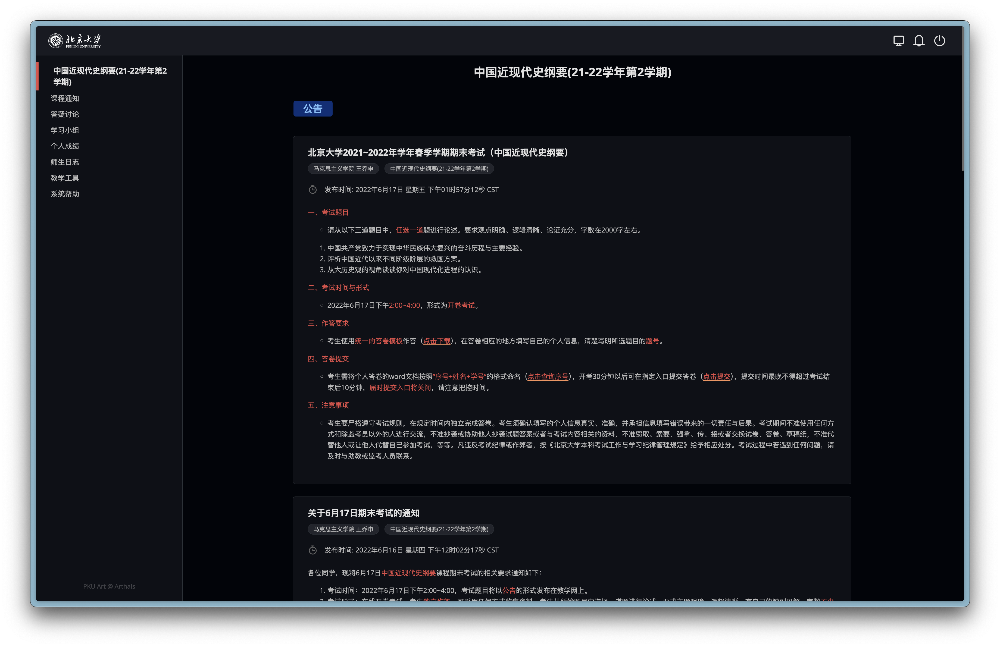
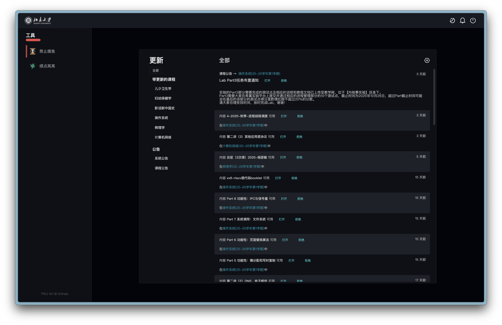
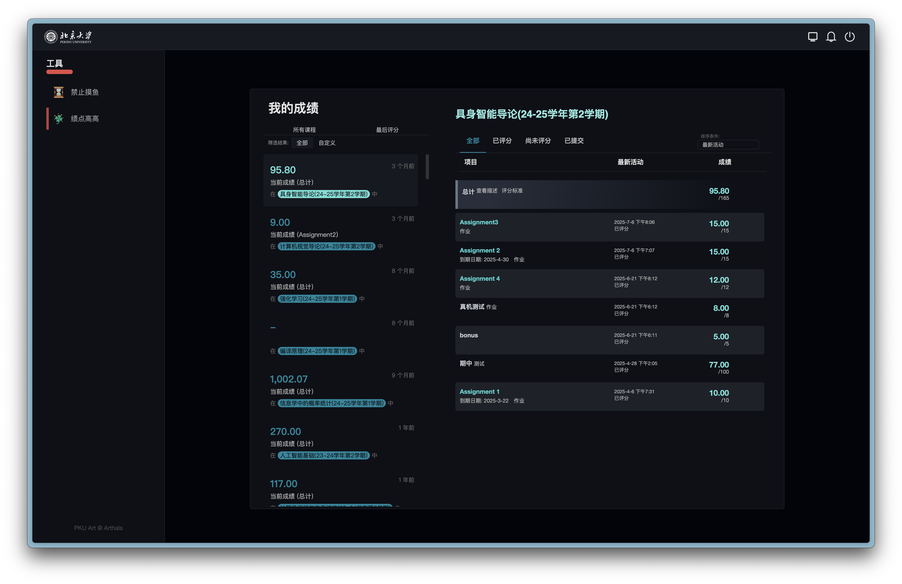
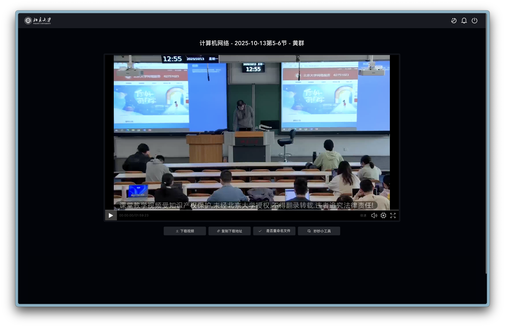

<div align="center">



# 🎨 PKU Art

</div>

PKU Art 是一款通过浏览器插件向页面附加的用户脚本（UserScript）。它可以完成对于原有样式的覆盖，从而增强教学网、选课网等北大相关网站的视觉体验与功能优化。

PKU Art 第一版发布于 2021 年 11 月，相对简陋；2022 年暑假更新的第二版实现了对第一版完整重构，完美支持了暗色模式，并且增加了更多的交互动效和设计改进。

<div align="center">

[💫 碎碎念](#-%E7%A2%8E%E7%A2%8E%E5%BF%B5) · [✨ 功能](#-%E5%8A%9F%E8%83%BD) · [📦 安装](#-%E5%AE%89%E8%A3%85) · [🚨 使用须知](#-%E4%BD%BF%E7%94%A8%E9%A1%BB%E7%9F%A5) · [🧑‍💻 贡献](#-%E8%B4%A1%E7%8C%AE) · [📝 更新日志](#-%E6%9B%B4%E6%96%B0%E6%97%A5%E5%BF%97) · [💬 Q&A](#-qa) · [📜 后记](#-%E5%90%8E%E8%AE%B0) · [📋 LICENSE](#-license)

</div>

## 💫 碎碎念

作为一名 PKUer，我从入学伊始就对教学网的样式适应不来，这做的真的太丑了！这怎么会让人有学习的动力呢？！我为什么老摸鱼？不就是因为这教学网让我看了就不想学习吗！（震声

这种不满终于入学考完第一个期中后的某个周四爆发了。我看着又土又老的编程网格，再也忍不下去了，正好周五加周末没啥事，于是开始快乐地在图书馆摸鱼（其实只有最后看到成果的时候才快乐，期间调各种样式啊选择器啊的时候让我简直要吐血，好多知识和语法还是边用边学的），爆肝出了编程网格、IAAA 登录页、教学网大部分页面的 CSS。

我真的很想吐槽那用 Table 搭出来的编程网格、大黑框顶头上的教学网，还有那设计简直离天下之大谱、让我甚至真的想问“就这还注册专利吗？”的成绩页面（它居然还用 iframe 套娃套了两层！），但最终，我还是完成了这个略显稚嫩的作品。而这，就是 PKU Art 的诞生了。

现在想想，两三天的时间换未来几年的视觉快感，也算是值辽！

## ✨ 功能

### `1` 界面美化、日夜模式随心切换

<details>
<summary>点击展开</summary>













</details>

### `2` 录播下载、重命名

<details>
<summary>点击展开</summary>



</details>

## 📦 安装

> [!WARNING]
> CSS 安装方式自 v2.6.0 版本更新后被完全移除，不再提供支持。请改用 JavaScript 安装方式。

PKU Art 目前只支持 JavaScript 安装方式，兼容 Safari 与 Chrome（Edge/Arc）两大浏览器。

### 前置插件需求

#### Chrome/Edge/Arc

> [!WARNING]
> 注意，由于 Chrome 权限更新，你可能需要在扩展页面打开开发者模式，详见 [这里](https://www.tampermonkey.net/faq.php?locale=en#Q209)。

需安装浏览器插件 [TamperMonkey](https://chrome.google.com/webstore/detail/tampermonkey/dhdgffkkebhmkfjojejmpbldmpobfkfo)，点开脚本页面后自动触发安装页面，跟随指引即可。

#### Safari

> [!IMPORTANT]  
> Safari 下推荐使用 TamperMonkey 插件，因为 UserScripts 插件在 Safari 下存在一些已知问题（插件功能支持有限，为了规避 CSP 限制启用了 `@inject-into page`，导致 GM API 完全不可用，且即使可用也未提供 `GM_download` API），导致不能实现录播下载重命名（但仍然可以下载 mp4 文件！）、复制视频下载链接等。

Safari 需安装浏览器插件 [UserScripts](https://apps.apple.com/cn/app/userscripts/id1463298887) 或者插件 [TamperMonkey](https://apps.apple.com/cn/app/tampermonkey/id6738342400)（售价 15 ￥，但是功能更全，推荐）：

-   UserScripts：安装好后点击工具栏图标，启用并授权后再在脚本页面点击图标，再点击 Click to install 即可安装。
-   TamperMonkey：点击链接会自动跳转到安装界面。

对比：TamperMonkey 相较 UserScripts 有着更宽松的权限管理，所以可以实现如下功能：

1. 无缝切换日夜模式，可穿透 `iframe`，在录播、课堂实录等页面会有感知，不过 UserScripts 也只需要刷新一下页面即可应用更改。
2. 支持下载重命名，但需要额外配置如下：在 TamperMonkey 的设置中的 `通用` 面板首先选择 `配置模式` 为 `高级`，随后找到 `下载 BETA` 中的 `下载模式` 选项，修改为 `浏览器 API` 才可以正常工作，否则会出现 `Out of memory` 的 Bug。不过此时无法正常使用 `onprogress` 回调，所以无法实时显示进度，但只要保持页面不关闭即可正常下载并重命名。

### 安装渠道

-   [CDN for JavaScript](https://cdn.arthals.ink/release/PKU-Art.user.js)：源代码更新后立即更新
-   [GreasyFork](https://greasyfork.org/zh-CN/scripts/436323-pku-art)：每天同步上述源一次

## 🚨 使用须知

本脚本移除了一些我觉得没有用处的控件元素，如侧栏的收起框（这个太丑了），播放列表上方的导航栏（下方有一样的），这可能会导致一些特殊情况下，某些功能不可用（如助教功能）。你可以 **随时在插件内禁用本样式** ，以恢复到原有界面。

本样式覆盖了所有我认为常用的界面，但我毕竟不是教学网的专业前端维护人员，所以我并不能做到对全部的页面加以修改。但如果你认为某个页面十分常用但却没有被修改，欢迎联系我，在 GitHub 提 issue，抑或是直接加我微信的方式（zhuozhiyongde）都可以。

如果你喜欢这个样式，请不要吝啬点击 Star（树洞和 GitHub 的都可以！），这是对我最大的鼓励与肯定！

## 🧑‍💻 贡献

欢迎为 PKU Art 贡献代码！

1. 克隆本项目：

    ```bash
    git clone https://github.com/zhuozhiyongde/PKU-Art.git
    ```

2. 进入工作目录，安装依赖：

    ```bash
    cd PKU-Art && bun install
    ```

3. 启动 Vite 服务器以获得 HMR 热更新开发体验：

    ```bash
    bun dev
    ```

4. 如果你需要引入新的图标（`src/css/src` 目录），你可能需要在本地额外启动文件服务器：

    ```bash
    python server.py
    ```

5. 编译，随后在本地预览：

    ```bash
    bun run build
    ```

6. 而后，你就可以发起 Pull Request，我将在审核代码后进行合并，随后更新 CDN。

## 📝 更新日志

参见 [ChangeLog.md](https://github.com/zhuozhiyongde/PKU-Art/blob/main/ChangeLog.md) 或 [GitHub Release](https://github.com/zhuozhiyongde/PKU-Art/releases)。

<div align="center">
  <div>
    <picture>
      <source
        media="(prefers-color-scheme: dark)"
        srcset="https://next.ossinsight.io/widgets/official/compose-activity-trends/thumbnail.png?repo_id=432452371&image_size=auto&color_scheme=dark"
        width="800"
        height="auto"
      />
      
    </picture>
  </div>
  &nbsp;
  <div>
  <picture>
    <source media="(prefers-color-scheme: dark)" srcset="https://next.ossinsight.io/widgets/official/analyze-repo-pushes-and-commits-per-month/thumbnail.png?repo_id=432452371&image_size=auto&color_scheme=dark" width="800" height="auto">
    
  </picture>
  </div>
  &nbsp;
  <div>
    <picture>
      <source
        media="(prefers-color-scheme: dark)"
        srcset="https://next.ossinsight.io/widgets/official/analyze-repo-stars-history/thumbnail.png?repo_id=432452371&image_size=auto&color_scheme=dark"
        width="800"
        height="auto"
      />
      
    </picture>
  </div>
</div>

## 💬 Q&A

### 有适配手机版的打算吗？

没有，做手机版自适应工程量几乎等于重构，一个人维护这个项目，我真的太累了 qwq...

### 可以在 iPad 上使用吗？

可以，方式等同于在 Safari 上使用 JavaScript 安装。

### 我可以审阅代码、提交 PR 吗？

十分欢迎！你可以随时访问我的 GitHub，哪里有本项目用到的所有代码。我可以保证项目内不含有任何恶意代码，仅仅是通过附加 css（通过 CDN 分发）来改变页面样式。如果你愿意提交 PR，那我会十分乐意接受的！

## 📜 后记

平日里的我并非是个话很多的人，但这堪称疯狂的一周，实在是让我感触颇丰，总觉得还是得记下点什么。

去年刚刚进入燕园的我，因为受不了编程网格的老土设计，在图书馆摸了好半天，就为了把编程网格做的好看了一点（[树洞#2908869](https://treehole.pku.edu.cn/web/#2908869)），彼时的我甚至连 CSS 的容器布局都不甚了解，好多知识都是在敲代码的过程中才去第一次认真学习，可我没想到的是哪个略显粗糙的拙劣样式，却得到了很多同学的肯定。于是我再接再厉，凭借着那三脚猫的功夫，滥用各种现在看起来简直不可接受的语句完成了对于教学网的美化（也正是这烂到几乎不可维护的屎山让我下定决心重构整个项目），发布了 PKU Art v1。承蒙厚爱，发布以后我得到了很多同学的赞扬，收获了至今为止 Star 最多的一个树洞 & 项目。那段时间我最快乐的一件事情就是每天刷树洞看看涨了多少关注，在 Stylish 上看看涨了多少下载（好虚荣啊 hhh），真是相当感谢大家的支持！

开心过后的我，却也从未忘记，那只是一个徒有其表的半成品，根本经不起哪怕一次 Code Review。事实上，自从发布以后，我自己也就是用着，而并没有想办法去优化。毕竟程序员们不总是有句老话嘛 —— 代码能跑就不要动。就这么凑合着，我搁置了这个项目。

时光转眼来到今年的八月一日。对前端一直很感兴趣的我，在七月份刚刚系统化学了一遍 JavaScript，Vue，React 等前端常用技术，也对 CSS 有了一些新的了解。就如同去年的我一样，闲到不知道干什么的我，终于还是给自己找起了事情做 —— 我要重构这一坨屎山代码！

重构的过程，用到的知识其实相较第一版并没有太大的差异，但有了系统化知识的打底，我对于页面结构有了更深的理解，没有再滥用万能的 translate，也没有随意乱加伪类，而是顺着原有的结构一步步选择适合的语句去实现我想要的效果。同时，一回生二回熟的我，也对教学网的路由和套娃谙熟于心，没有再像之前一样对着一个 iframe 愣半天，也通过正则表达式对于样式生效的网址有了更精细的控制。

要说这一周真的学到了什么，我想，也没有什么。抠细节带来的大概只有对于耐心的考验，每个页面，我大概都要写数个小时才能满意，每个用到颜色的地方我都使用了变量来保证在黑暗模式下的可用性，每个我觉得原先图标不行的地方我都专门去 IconPark 网站上找了替代品并加以更换。Mac 告诉我，为了完成这个项目，我的相关屏幕使用时间在上周达到了 50 个小时，然而这还不算我找参考，挑配色的时间。

我向来是一个对于自己感兴趣的事物会不惜代价去投入的人，可是这次所花费的时间和最终写出的代码行数都远远超出了我最开始的预期。

期间，我也不是没有心生厌倦，我曾问过自己，就算花了这么久时间去写，最后能用上的又有多少人？我付出的时间精力难道不是自娱自乐吗？万一教学网也像编程网格一样更新了样式怎么办？... 但我却总是安慰自己，已经写了这么多了（沉没价值啊啊啊啊），怎么能忍心半途而废呢？于是，就在这种一边否定自己，一边问怀疑原有代码究竟是怎么写出来的，一边机械化的敲着已经用了数百遍的那些属性和变量的过程中，我还是渐渐磨出来了最终的成果 —— 全新的、带黑暗模式的 PKU Art v2。

于是，我终于相信，这一版的 PKU Art v2，足够让我、让大家满意。

## 📋 LICENSE

GPL-3.0 license
